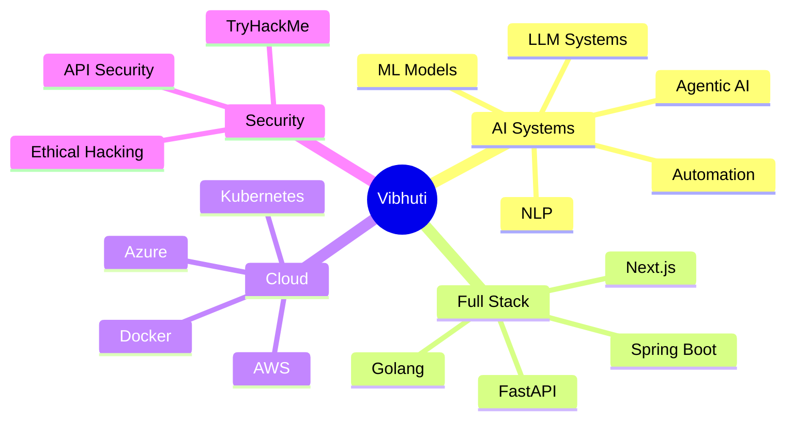

<div align="center">


<br/>


<br/>


<br/><br/>

<a href="https://www.linkedin.com/in/vibhuti019/">

</a>

<a href="mailto:vibhuti.singh037@gmail.com">

</a>

<a href="https://tryhackme.com/p/vibhuti019">

</a>

<a href="https://clicktoautomate.in">

</a>

</div>

---

#  SYSTEM.OUT.PRINTLN("HELLO WORLD") vs PRINT("HELLO WORLD")

<table>
<tr>

<td width="55%">

```yaml
name: Vibhuti Singh

role:
  Founder & Innovation Lead

company:
  Click To Automate

location:
  India 🇮🇳

specialization:
  [
    "AI Systems",
    "Automation Engineering",
    "Cloud Native Platforms",
    "Full Stack Development",
    "Scalable SaaS Architectures",
    "Workflow Optimization",
    "Agentic AI Systems"
  ]

currently_building:
  [
    "AI Automation Workflows",
    "Next.js Platforms",
    "Business Automation Systems",
    "Cloud APIs",
    "Developer Tools",
    "AI SaaS Products"
  ]

philosophy:
  "Build systems that scale humans."
````

</td>

<td width="45%">

<div align="center">


<br/><br/>


</div>

</td>

</tr>
</table>

---

<table>
<tr>

<td width="60%">

```bash
> whoami

Vibhuti Singh

Founder @ Click To Automate
Software Engineer 2 @ DXC Technology

> skills --list

AI Systems
Automation Architecture
Cloud Native Applications
Backend Engineering
System Design
Developer Experience
Full Stack Platforms

> current_status

Building intelligent automation systems for the future.

> mission

Turn ideas into scalable digital systems.
```

</td>

<td width="40%">

<div align="center">


<br/><br/>


</div>

</td>

</tr>
</table>

---


#  ABOUT ME

<table>
<tr>

<td width="60%">

I’m a **Full Stack Engineer, AI Builder, Automation Strategist, and Product Engineer** passionate about creating systems that solve real-world business problems through intelligent automation and scalable architecture.

###  CURRENTLY

*  Founder @ **Click To Automate**
*  Software Engineer 2 @ **DXC Technology**
*  Building AI-powered automation ecosystems
*  Designing cloud-native architectures
*  Exploring autonomous AI workflows
*  Creating developer-first platforms

### ❤️ I LOVE BUILDING

* AI SaaS Products
* Automation Systems
* Full Stack Platforms
* Enterprise APIs
* Cloud Infrastructure
* Scalable Backend Systems
* Product Engineering
* AI Agents & Workflows

</td>

<td width="40%">

<div align="center">


<br/><br/>


</div>

</td>

</tr>
</table>

---

#  EXPERIENCE

<table>
<tr>

<td width="58%">

##  Click To Automate — Founder & Innovation Lead

`Sep 2025 - Present`

###  WHAT I DO

* Build AI-powered automation platforms
* Design scalable SaaS systems
* Lead innovation strategy
* Create workflow automation ecosystems
* Mentor developers & engineers
* Build cloud-native business solutions

---

##  DXC Technology — Software Engineer 2

`Oct 2023 - Present`

###  RESPONSIBILITIES

* Backend modernization
* Azure cloud infrastructure
* Python business systems
* Linux server operations
* Database optimization
* Enterprise workflow engineering

---

##  Paytm — Java Developer Intern

`Jun 2022 - Dec 2022`

###  WORKED ON

* API testing & automation
* SpringBoot architecture
* TestNG automation
* Jenkins CI/CD
* REST API validation
* Transaction service testing

</td>

<td width="42%">

<div align="center">


<br/><br/>


<br/><br/>


</div>

</td>

</tr>
</table>

---


#  TECH STACK

<div align="center">


<br/><br/>


</div>

<br/>

<div align="center">


</div>

---

#  AI + AUTOMATION ECOSYSTEM

<table>
<tr>

<td width="60%">



</td>

<td width="40%">

<div align="center">


<br/><br/>


</div>

</td>

</tr>
</table>

---

#  DEVELOPMENT ANALYTICS

<div align="center">


</div>

<br/>

<div align="center">


</div>

<br/>

<div align="center">


</div>

---

#  ACHIEVEMENTS

<div align="center">


</div>

---

#  CONTRIBUTION GRAPH

<div align="center">


</div>

---

#  CONTRIBUTION SNAKE

<div align="center">


</div>

---

#  ADVANCED METRICS

<div align="center">


</div>

---

#  BUILDING @ CLICK TO AUTOMATE

<table>
<tr>

<td width="60%">

###  FOCUS AREAS

* AI Agents
* Workflow Automation
* SaaS Platforms
* Cloud Infrastructure
* Product Engineering
* Business Automation
* Enterprise APIs
* Scalable Architectures

###  BUILDING FOR

* Startups
* Businesses
* Creators
* Enterprise Workflows

</td>

<td width="40%">

<div align="center">


<br/><br/>


</div>

</td>

</tr>
</table>

---

#  CERTIFICATIONS

<table>
<tr>

<td width="60%">

###  IIITH — Post Graduate Certificate Program in Software Engineering for Data Science

🔗 [https://www.mygreatlearning.com/certificate/VVRCPVAB](https://www.mygreatlearning.com/certificate/VVRCPVAB)

###  AWS Services for Solutions Architect Associate

🔗 [https://www.udemy.com/certificate/UC-da87461c-d469-4b62-ac30-815131096d1f/](https://www.udemy.com/certificate/UC-da87461c-d469-4b62-ac30-815131096d1f/)

###  Secure Coding Guide for Developers, Analysts and Architects

🔗 [https://www.udemy.com/certificate/UC-d2b73322-ed78-43d2-a5d4-57daf6cf5e8f/](https://www.udemy.com/certificate/UC-d2b73322-ed78-43d2-a5d4-57daf6cf5e8f/)

###  Cisco CCNA: Introduction to Networks

🔗 [https://www.credly.com/badges/ffb0d49c-9bc5-4ae7-a124-acfb84145b80](https://www.credly.com/badges/ffb0d49c-9bc5-4ae7-a124-acfb84145b80)

###  Linux Foundation — Linux Kernel Development

🔗 [https://ti-user-certificates.s3.amazonaws.com/e0df7fbf-a057-42af-8a1f-590912be5460/7ce58d7c-5291-41cf-b746-384c3a4e745d-vibhuti-singh-a-beginners-guide-to-linux-kernel-development-lfd103-certificate.pdf](https://ti-user-certificates.s3.amazonaws.com/e0df7fbf-a057-42af-8a1f-590912be5460/7ce58d7c-5291-41cf-b746-384c3a4e745d-vibhuti-singh-a-beginners-guide-to-linux-kernel-development-lfd103-certificate.pdf)

###  Cisco Introduction to IoT

🔗 [https://www.credly.com/badges/ca96ed7c-fb5f-4e4d-8059-d9c44c8fa450](https://www.credly.com/badges/ca96ed7c-fb5f-4e4d-8059-d9c44c8fa450)

###  Cisco Introduction to Packet Tracer

🔗 [https://www.credly.com/badges/e4234a33-1953-4b2e-88fb-6babc73f9220](https://www.credly.com/badges/e4234a33-1953-4b2e-88fb-6babc73f9220)

###  Hack With Mait

🔗 [https://drive.google.com/file/d/1-kieQHuUAceTN00cBrNCAMxN3mRkZePe/view](https://drive.google.com/file/d/1-kieQHuUAceTN00cBrNCAMxN3mRkZePe/view)

###  TryHackMe — Top 10 Hackers

🔗 [https://tryhackme.com/room/squidgameroom](https://tryhackme.com/room/squidgameroom)

</td>

<td width="40%">

<div align="center">


<br/><br/>


</div>

</td>

</tr>
</table>

---

#  OPEN SOURCE + COMMUNITY

<table>
<tr>

<td width="60%">

* ❤️ Open Source Enthusiast
* 🤝 AI & Automation Community Builder
* 🧠 Technical Mentoring
* ⚡ Workflow Optimization Advocate
* 🚀 Startup & Product Innovation Focused
* 🌍 Building systems for global scalability

</td>

<td width="40%">

<div align="center">


</div>

</td>

</tr>
</table>

---

#  CURRENT GOALS

```diff
+ Build globally scalable AI SaaS products
+ Create autonomous automation systems
+ Build production-ready AI workflows
+ Contribute heavily to open source
+ Build developer-first platforms
+ Scale Click To Automate globally
```

---

#  RANDOM DEV QUOTE

<div align="center">


</div>

---

#  CONNECT WITH ME

<div align="center">

<a href="mailto:vibhuti.singh037@gmail.com">

</a>

<a href="https://www.linkedin.com/in/vibhuti019/">

</a>

<a href="https://github.com/vibhuti019">

</a>

<a href="https://tryhackme.com/p/vibhuti019">

</a>

</div>

---

<div align="center">

## ⚡ "Innovation distinguishes between a leader and a follower."


</div>
